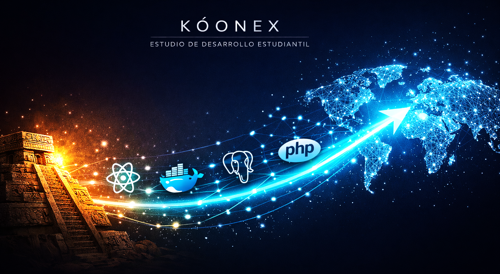

<!--
Banner recomendado:
1) Guarda tu imagen en profile/banner.png
2) Ajusta el nombre del archivo si usas otro
-->

  <h1>Koonex</h1>
  
<strong>Transformamos aprendizaje en soluciones de software de alto impacto.</strong>

  
<i>Merida, Yucatan, Mexico</i>

  
  
  

## Quienes somos
Koonex (del maya: "Vamos") es un equipo de ingenieria de software en formacion que construye productos reales con estandares profesionales.
Nuestro objetivo es profesionalizar el desarrollo estudiantil y convertir ideas complejas en herramientas utiles, estables y escalables.

## Que hacemos
- Construimos aplicaciones web fullstack para resolver problemas operativos reales.
- Diseñamos flujos de trabajo claros para reducir tiempos manuales y errores.
- Implementamos despliegues reproducibles con buenas practicas de desarrollo.

## Stack actual

### Frontend
| Tecnologia | Uso |
| :--- | :--- |
| React | Interfaces dinamicas y componentes reutilizables |
| JavaScript (ES6+) | Logica de cliente moderna |
| Tailwind CSS | Estilos rapidos con enfoque utility-first |

### Backend y datos
| Tecnologia | Uso |
| :--- | :--- |
| Laravel (PHP) | Backend robusto y mantenible |
| PostgreSQL | Datos relacionales con alta integridad |
| Docker | Entornos consistentes para desarrollo y despliegue |

### Reporteria
- Crystal Reports para reportes operativos y administrativos.

## Proyecto destacado: Nexnotarial
Nexnotarial es una plataforma para digitalizar y automatizar procesos de Notarias Publicas.

### Capacidades clave
- Gestion de expedientes y trazabilidad documental.
- Automatizacion de flujos para tramites administrativos.
- Arquitectura escalable con Docker y PostgreSQL.
- Generacion de reportes listos para firma y archivo.

> Este proyecto refleja nuestra capacidad para modelar procesos legales complejos y convertirlos en software util.

## Repositorios destacados
Cuando el repositorio de Nexnotarial este publicado, fijalo con la opcion **Pin** para que aparezca en el perfil junto al README.

- Nexnotarial (proximamente)
- [Agregar otro proyecto destacado](#)

## Vision
Impulsar talento joven en Yucatan con desarrollo de software que compite con estandares internacionales.

## Contacto
Si quieres colaborar, conocer el proyecto o proponer una alianza:

- Lider de proyecto: [Nombre Apellido](#)
- Ubicacion: Merida, Yucatan, Mexico
- LinkedIn: [Perfil de LinkedIn](#)
- Email: contacto@koonex.dev

---

<i>"El codigo es nuestra herramienta, el progreso es nuestro objetivo."</i>

